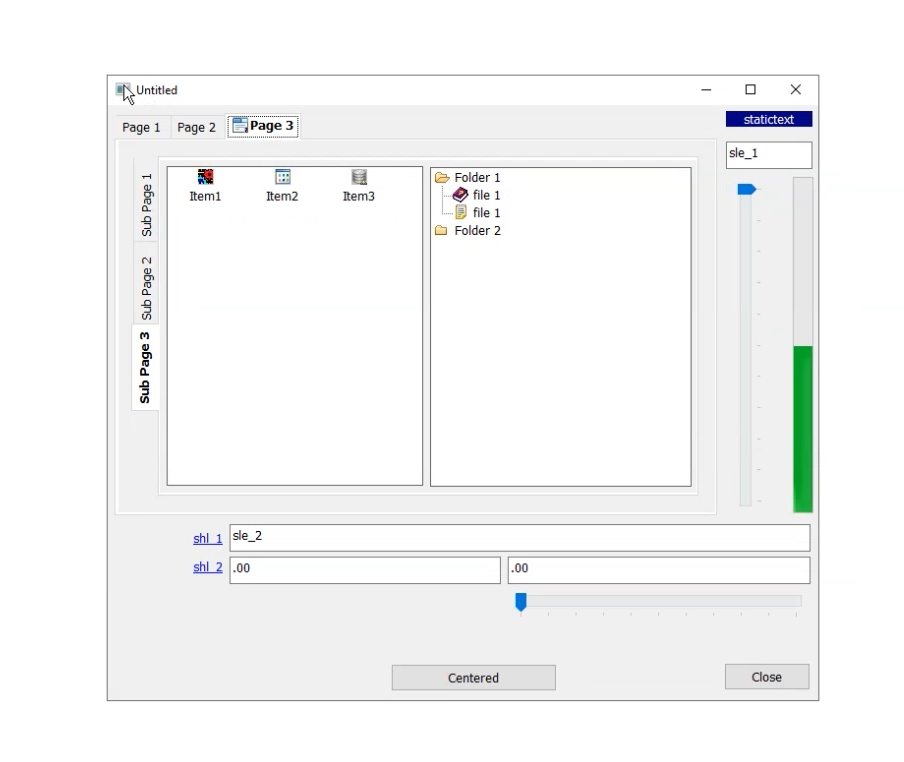

README
======

The `nv_auto_resizer` is a non visual object that you can use as a service in your window or visual user object to easy resize your control we a few efforts.
Its let you configure how your controls will be resized or/and moved depending on the new container size based on a small format added in controls's tag property.

PREREQUIRE
==========

PowerBuilder v9 or earlier.
It may be possible to backport with easily.

INSTALLATION
============

Import nv_auto_resize.sru in your application.

SYNOPSIS
========

Add an instance variable to your window/user object:
```
nv_auto_resizer inv_resizer
```

In the open event of the window or constructor of visual user object:
```
inv_resizer = create nv_auto_resizer
inv_resizer.initialize( this, this)
```

And cleanup in the close event of the window or destructor of visual user object:
```
destroy inv_resizer
```

Then in the resize event of the window of add a pbm_size event in the visual user object:
```
if isvalid(inv_resizer) and not isnull(inv_resizer) then
	this.setredraw( false )
	inv_resizer.event resize( sizetype, width, height )
	this.setredraw( true )
end if
```

Add anchor specification to controls in the tag property in the designer :

* "BR;" to anchor at the bottom - right
* "B;" to anchor at the bottom - left
* "TBLR;" to anchor all direction, making the control to shrink/expand in both direction.
* "LR;" to anchor left and right so that width will grow with container

[](https://github.com/xlat/nv_auto_resizer/raw/main/demo.webp)

TAG FORMAT
==========
To anchor a control, just prepend to the "tag" property a combination of :
	T : anchor to top
	B : anchor to bottom
	L : anchor to left
	R : anchor to right
	; : used to separate the anchor specifications from the rest of the tag
	
A tag clean up will be done just after initialisation, allowing your code to works just as is this anchors specs was not included.

TODO
====

* handle proportional resize, eg: 
  * tag="w=50,h=10;" 
  * tag="wh=*;" (proportion will be computed at initialization call)
  * tag="a;" (keep aspect ratio)
* handle DataWindow inner controls anchoring

LICENSE
=======

MIT No Attribution

Copyright 2023, Nicolas GEORGES.

Permission is hereby granted, free of charge, to any person obtaining a copy of this software and associated documentation files (the "Software"), to deal in the Software without restriction, including without limitation the rights to use, copy, modify, merge, publish, distribute, sublicense, and/or sell copies of the Software, and to permit persons to whom the Software is furnished to do so.

THE SOFTWARE IS PROVIDED "AS IS", WITHOUT WARRANTY OF ANY KIND, EXPRESS OR IMPLIED, INCLUDING BUT NOT LIMITED TO THE WARRANTIES OF MERCHANTABILITY, FITNESS FOR A PARTICULAR PURPOSE AND NONINFRINGEMENT. IN NO EVENT SHALL THE AUTHORS OR COPYRIGHT HOLDERS BE LIABLE FOR ANY CLAIM, DAMAGES OR OTHER LIABILITY, WHETHER IN AN ACTION OF CONTRACT, TORT OR OTHERWISE, ARISING FROM, OUT OF OR IN CONNECTION WITH THE SOFTWARE OR THE USE OR OTHER DEALINGS IN THE SOFTWARE.
